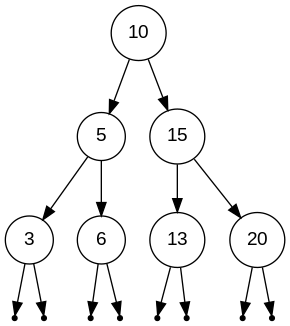
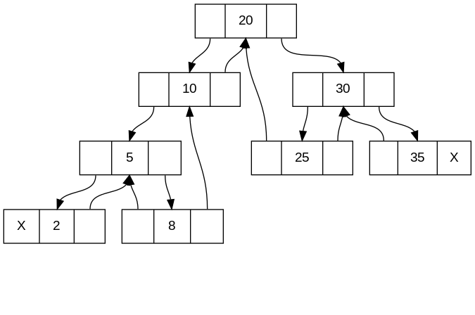
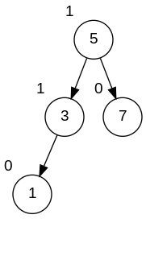

# Data Structure Visualization using Graphviz Library

This project provides a visualization tool for various data structures using the Graphviz library. The goal of this project is to help developers and students better understand the internal workings of different data structures by providing visual representations of their elements and relationships.

## Table of Contents
- [Introduction](#introduction)
- [Getting Started](#getting-started)
- [Supported Data Structures](#supported-data-structures)
- [Usage](#usage)
- [Dependencies](#dependencies)
- [Contributing](#contributing)
- [License](#license)

## Introduction
Data structures are essential components of computer science and programming. However, comprehending how data is stored and accessed within different data structures can be challenging for beginners. This project aims to address this issue by offering a visualization tool that provides graphical representations of data structures, making it easier to grasp their internal organization and relationships.

The project currently supports the visualization of Binary Search Trees (BST) and Threaded Binary Trees. More data structures may be added in the future, as the project evolves.

## Getting Started
To use the visualization tool, follow these steps:

1. Clone the repository:
```bash
git clone https://github.com/your-username/data-structure-visualization.git
```
2. Install the Graphviz library:
Ensure you have Graphviz installed on your system. You can download it from the official Graphviz website (https://graphviz.org/download/).

3. Compile the C code:
Compile the C code using your preferred C compiler. For example:
```bash
gcc -o visualization main.c utility.c bst.c threaded_bst.c -lgvc
```

4. Run the application:
```bash
./visualization
```

## Supported Data Structures
The current version of the project supports the visualization of the following data structures:

1. **Binary Search Tree (BST)**: Visualizes the operations and organization of a binary search tree.

2. **Threaded Binary Tree**: Visualizes a one way and two-way threaded binary trees with all of its operations.

Other data structures such as AVL Trees and Red-Black Trees and other more complex data structures may be included in future updates.

## Usage
Upon running the application, you will be presented with a main menu, providing the following options:

1. **Tree Data Structure**: Allows you to select a tree data structure for visualization.

2. **Linked List Data Structure**: (Feature not implemented yet)

3. **EXIT**: Exits the program.

### Tree Data Structure Visualization


Upon selecting the "Tree Data Structure" option, you will be presented with the Tree Visualization menu, where you can choose from the available tree data structures:

1. **Binary Search Tree (BST)**: Visualizes the Binary Search Tree data structure.



2. **Threaded Binary Tree**: Visualizes the One-way Threaded (Right and Left Threaded binary tree) data structures and two-way threaded binary tree data structures.



3. **AVL Tree**: Visualizes AVL tree data structure with all insert, delete, search and more operations implemented correctly.



4. **Red-Black Tree**: (Feature not implemented yet)

5. **Return to main menu**: Returns to the main menu.

### Input Validation
The application performs input validation, ensuring that only valid options are accepted. If an invalid option is entered, the application will prompt for a valid input or return the user to the previous menu.

## Dependencies
The project relies on the Graphviz library for generating graphical representations of data structures. Ensure you have Graphviz installed before running the application.

## Contributing
Contributions to this project are welcome. If you have ideas for new features, improvements, or bug fixes, feel free to submit a pull request. Please ensure to follow the coding conventions and provide clear commit messages.

## License
This project is licensed under the [MIT License](LICENSE). Feel free to use, modify, and distribute the code according to the terms of the license.

---
